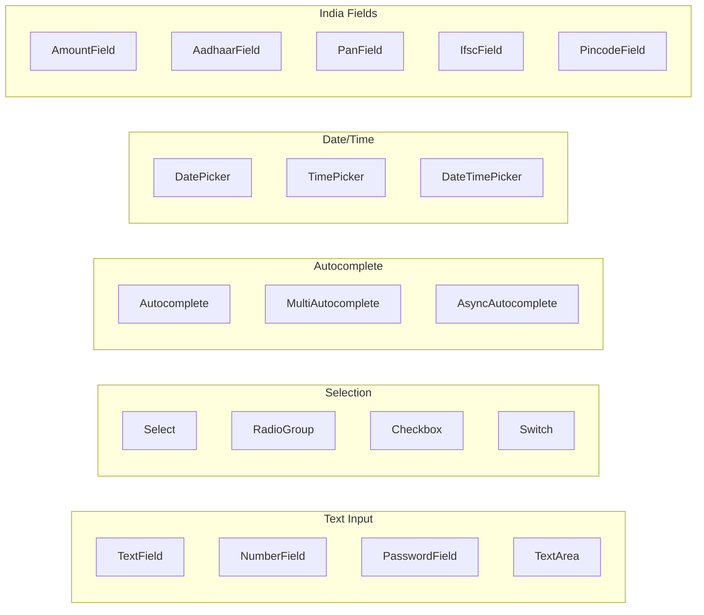

# @paramhq/forms

React Hook Form + MUI + Zod form components library.

A comprehensive collection of pre-built form components that integrate React Hook Form with Material-UI and Zod validation.

## Features

- **Type-Safe Forms** - Full TypeScript support with Zod schema inference
- **MUI Integration** - Native Material-UI components with all props supported
- **Validation** - Automatic Zod validation with real-time error display
- **India-Specific Fields** - Aadhaar, PAN, GST, IFSC, Pincode with built-in validation
- **Date/Time Pickers** - MUI X Date Pickers integration
- **Field Arrays** - Dynamic form fields with add/remove
- **Async Support** - Async autocomplete, async form submission

## Installation

```bash
npm install @paramhq/forms

# Peer dependencies
npm install react-hook-form @hookform/resolvers zod @mui/material @emotion/react @emotion/styled
```

## Quick Start

```tsx
import { Form, RHFTextField, RHFSelect } from '@paramhq/forms';
import { z } from 'zod';

const schema = z.object({
  name: z.string().min(1, 'Name is required'),
  email: z.string().email('Invalid email'),
  role: z.string().min(1, 'Select a role'),
});

function MyForm() {
  const handleSubmit = (data) => {
    console.log(data);
  };

  return (
    <Form
      schema={schema}
      defaultValues={{ name: '', email: '', role: '' }}
      onSubmit={handleSubmit}
    >
      <RHFTextField name="name" label="Name" />
      <RHFTextField name="email" label="Email" type="email" />
      <RHFSelect
        name="role"
        label="Role"
        options={[
          { value: 'admin', label: 'Admin' },
          { value: 'user', label: 'User' },
        ]}
      />
      <Button type="submit">Submit</Button>
    </Form>
  );
}
```

## Available Components



| Category | Components |
|----------|------------|
| **Text Input** | `RHFTextField`, `RHFNumberField`, `RHFPasswordField`, `RHFTextArea` |
| **Selection** | `RHFSelect`, `RHFRadioGroup`, `RHFCheckbox`, `RHFCheckboxGroup`, `RHFSwitch` |
| **Autocomplete** | `RHFAutocomplete`, `RHFMultiAutocomplete`, `RHFAsyncAutocomplete`, `RHFCreatableAutocomplete` |
| **Date/Time** | `RHFDatePicker`, `RHFTimePicker`, `RHFDateTimePicker` |
| **Advanced** | `RHFFieldArray`, `RHFSlider`, `RHFRating`, `RHFFileUpload` |
| **India-Specific** | `RHFAmountField`, `RHFAadhaarField`, `RHFPanField`, `RHFMobileField`, `RHFIfscField`, `RHFPincodeField`, `RHFGstField` |

## India-Specific Features

### IFSC Code with Bank Lookup

```tsx
<RHFIfscField
  name="ifsc"
  label="IFSC Code"
  onBankDetails={(details) => {
    console.log(details.bank, details.branch);
  }}
/>
```

### Pincode with Location Lookup

```tsx
<RHFPincodeField
  name="pincode"
  label="Pincode"
  onLocationDetails={(details) => {
    console.log(details.city, details.state);
  }}
/>
```

### Aadhaar with Verhoeff Validation

```tsx
<RHFAadhaarField
  name="aadhaar"
  label="Aadhaar Number"
  masked={true}  // Shows XXXX XXXX 1234
/>
```

## Date Pickers

Requires `@mui/x-date-pickers` and a date adapter:

```bash
npm install @mui/x-date-pickers dayjs
```

```tsx
import { LocalizationProvider } from '@mui/x-date-pickers';
import { AdapterDayjs } from '@mui/x-date-pickers/AdapterDayjs';

// Wrap your app
<LocalizationProvider dateAdapter={AdapterDayjs}>
  <App />
</LocalizationProvider>
```

```tsx
import dayjs from 'dayjs';

<RHFDatePicker
  name="birthDate"
  label="Date of Birth"
  disableFuture
  maxDate={dayjs().subtract(18, 'year')}
/>
```

## Documentation

View documentation in the [package files](https://www.npmjs.com/package/@paramhq/forms?activeTab=code):

- `docs/01-architecture.md` - Why controlled components are used
- `docs/02-performance.md` - Performance optimization guide  
- `docs/03-components.md` - Complete component reference
- `docs/04-llm-integration.md` - AI/LLM integration guide
- `CLAUDE.md` - AI agent context file

## Demo

Run the demo app:

```bash
cd apps/demo
npm install
npm run dev
```

Visit http://localhost:5173

## License

MIT
