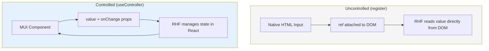
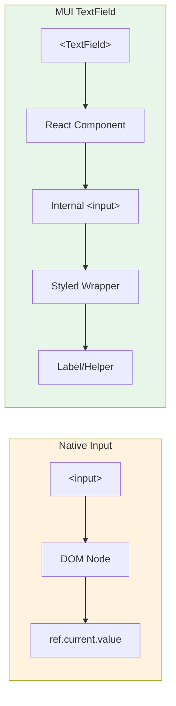
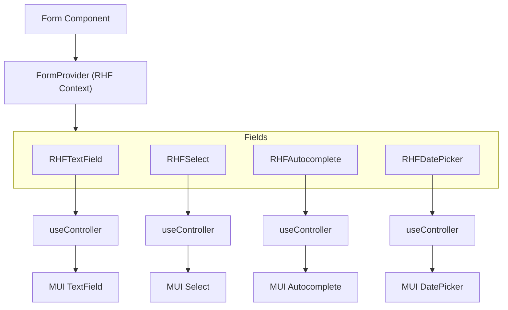

# Architecture: Controlled Components

This document explains why @rhf-mui/core uses controlled components and how this integrates with React Hook Form.

## Overview

All form field wrappers in this library use React Hook Form's `useController` hook, making them **controlled components**. This is a deliberate architectural decision required for MUI integration.

## Controlled vs Uncontrolled in React Hook Form



### Uncontrolled Approach (`register`)

```tsx
// Works ONLY with native HTML inputs
<input {...register('name')} />
<select {...register('country')}>...</select>
<textarea {...register('bio')} />
```

React Hook Form attaches a `ref` directly to the DOM element and reads values from the DOM. This is the most performant approach but **only works with native HTML elements**.

### Controlled Approach (`useController`)

```tsx
// Required for MUI and other React component libraries
const { field } = useController({ name: 'name', control });

<TextField 
  value={field.value} 
  onChange={field.onChange}
  onBlur={field.onBlur}
  inputRef={field.ref}
/>
```

React Hook Form manages the field state in React and passes `value`/`onChange` props to the component.

## Why MUI Requires Controlled Components

MUI components are **React components**, not native HTML elements. They:

1. **Don't expose a native DOM ref** - You can't attach `register()` to them
2. **Have internal state** - They manage their own rendering
3. **Expect value/onChange** - This is how React components communicate



## Implementation Pattern

Every RHF wrapper in this library follows this pattern:

```tsx
export function RHFTextField<T extends FieldValues>({
  name,
  control,
  rules,
  defaultValue,
  shouldUnregister,
  // ...other props
}: RHFTextFieldProps<T>) {
  // 1. Use useController to connect to RHF
  const {
    field: { value, onChange, onBlur, ref },
    fieldState: { error },
  } = useController({
    name,
    control,
    rules,
    defaultValue,
    shouldUnregister,
  });

  // 2. Pass controlled props to MUI component
  return (
    <TextField
      value={value ?? ''}
      onChange={onChange}
      onBlur={onBlur}
      inputRef={ref}
      error={!!error}
      helperText={error?.message}
      // ...other props
    />
  );
}
```

## Component Hierarchy



## Key Benefits

| Benefit | Description |
|---------|-------------|
| **Type Safety** | Full TypeScript support with inferred types from Zod schema |
| **Validation Integration** | Errors automatically displayed via `fieldState.error` |
| **Form State Access** | Components can access `isDirty`, `isTouched`, etc. |
| **Consistent API** | All components follow the same pattern |
| **MUI Compatibility** | Full support for all MUI props and features |

## Trade-offs

| Aspect | Controlled | Uncontrolled |
|--------|------------|--------------|
| Performance | Slightly more re-renders | Minimal re-renders |
| Compatibility | Works with any React component | Native inputs only |
| State Access | Full access to field state | Limited |
| Validation UX | Real-time error display | On submit only |

## Conclusion

The controlled approach with `useController` is **required** for MUI integration. While it has slightly more overhead than the uncontrolled `register` approach, it provides:

- Full compatibility with MUI's component model
- Better developer experience with TypeScript
- Real-time validation feedback
- Access to complete field state

For detailed performance considerations and optimization strategies, see [02-performance.md](./02-performance.md).
