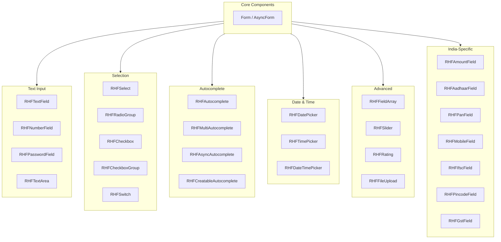

# Component Reference

Complete reference for all form components in @rhf-mui/core.

## Component Overview



---

## Core Components

### Form

The main form wrapper that provides React Hook Form context with Zod validation.

```tsx
import { Form } from '@rhf-mui/core';
import { z } from 'zod';

const schema = z.object({
  name: z.string().min(1, 'Required'),
  email: z.string().email(),
});

<Form
  schema={schema}
  defaultValues={{ name: '', email: '' }}
  onSubmit={(data) => console.log(data)}
>
  {/* Form fields */}
</Form>
```

| Prop | Type | Description |
|------|------|-------------|
| `schema` | `ZodSchema` | Zod validation schema |
| `defaultValues` | `object` | Initial form values |
| `onSubmit` | `(data) => void` | Submit handler |
| `mode` | `'onBlur' \| 'onChange' \| 'onSubmit'` | Validation mode |
| `children` | `ReactNode` | Form content |

### AsyncForm

Form variant for async operations with loading state.

```tsx
<AsyncForm
  schema={schema}
  defaultValues={defaultValues}
  onSubmit={async (data) => {
    await api.saveData(data);
  }}
>
  {({ isSubmitting }) => (
    <>
      <RHFTextField name="name" />
      <Button type="submit" disabled={isSubmitting}>
        {isSubmitting ? 'Saving...' : 'Save'}
      </Button>
    </>
  )}
</AsyncForm>
```

---

## Text Input Components

### RHFTextField

Standard text input field.

```tsx
<RHFTextField
  name="username"
  label="Username"
  placeholder="Enter username"
  helperText="Your unique identifier"
  required
/>
```

| Prop | Type | Description |
|------|------|-------------|
| `name` | `string` | Field name (required) |
| `label` | `string` | Field label |
| `placeholder` | `string` | Placeholder text |
| `helperText` | `string` | Helper text below field |
| `required` | `boolean` | Show required indicator |
| `disabled` | `boolean` | Disable input |
| `...TextFieldProps` | - | All MUI TextField props |

### RHFNumberField

Numeric input with formatting.

```tsx
<RHFNumberField
  name="quantity"
  label="Quantity"
  min={0}
  max={100}
  step={1}
/>
```

### RHFPasswordField

Password input with visibility toggle.

```tsx
<RHFPasswordField
  name="password"
  label="Password"
  showToggle={true}
/>
```

### RHFTextArea

Multi-line text input.

```tsx
<RHFTextArea
  name="description"
  label="Description"
  rows={4}
  maxRows={8}
/>
```

---

## Selection Components

### RHFSelect

Dropdown select field.

```tsx
<RHFSelect
  name="country"
  label="Country"
  options={[
    { value: 'us', label: 'United States' },
    { value: 'uk', label: 'United Kingdom' },
    { value: 'in', label: 'India' },
  ]}
/>
```

| Prop | Type | Description |
|------|------|-------------|
| `name` | `string` | Field name (required) |
| `options` | `SelectOption[]` | Array of options |
| `label` | `string` | Field label |
| `multiple` | `boolean` | Allow multiple selection |

### RHFRadioGroup

Radio button group.

```tsx
<RHFRadioGroup
  name="gender"
  label="Gender"
  options={[
    { value: 'male', label: 'Male' },
    { value: 'female', label: 'Female' },
    { value: 'other', label: 'Other' },
  ]}
  row
/>
```

### RHFCheckbox

Single checkbox.

```tsx
<RHFCheckbox
  name="acceptTerms"
  label="I accept the terms and conditions"
/>
```

### RHFCheckboxGroup

Multiple checkbox selection.

```tsx
<RHFCheckboxGroup
  name="interests"
  label="Interests"
  options={[
    { value: 'sports', label: 'Sports' },
    { value: 'music', label: 'Music' },
    { value: 'travel', label: 'Travel' },
  ]}
/>
```

### RHFSwitch

Toggle switch.

```tsx
<RHFSwitch
  name="notifications"
  label="Enable notifications"
/>
```

---

## Autocomplete Components

### RHFAutocomplete

Basic autocomplete with static options.

```tsx
<RHFAutocomplete
  name="city"
  label="City"
  options={cities}
  getOptionLabel={(option) => option.name}
/>
```

### RHFMultiAutocomplete

Multiple selection autocomplete.

```tsx
<RHFMultiAutocomplete
  name="tags"
  label="Tags"
  options={availableTags}
  freeSolo
/>
```

### RHFAsyncAutocomplete

Autocomplete with async option loading.

```tsx
<RHFAsyncAutocomplete
  name="user"
  label="Search User"
  loadOptions={async (inputValue) => {
    const response = await api.searchUsers(inputValue);
    return response.data;
  }}
  getOptionLabel={(option) => option.name}
/>
```

### RHFCreatableAutocomplete

Autocomplete that allows creating new options.

```tsx
<RHFCreatableAutocomplete
  name="category"
  label="Category"
  options={categories}
  onCreate={(inputValue) => ({ id: 'new', name: inputValue })}
/>
```

---

## Date & Time Components

> **Note**: Requires `@mui/x-date-pickers` and a date adapter (e.g., `dayjs`).

### RHFDatePicker

Date selection.

```tsx
import dayjs from 'dayjs';

<RHFDatePicker
  name="birthDate"
  label="Date of Birth"
  disableFuture
  openTo="year"
  views={['year', 'month', 'day']}
/>
```

| Prop | Type | Description |
|------|------|-------------|
| `name` | `string` | Field name (required) |
| `label` | `string` | Field label |
| `disableFuture` | `boolean` | Disable future dates |
| `disablePast` | `boolean` | Disable past dates |
| `minDate` | `Dayjs` | Minimum selectable date |
| `maxDate` | `Dayjs` | Maximum selectable date |
| `views` | `string[]` | Available views |
| `format` | `string` | Display format |

### RHFTimePicker

Time selection.

```tsx
<RHFTimePicker
  name="meetingTime"
  label="Meeting Time"
  ampm={false}
/>
```

### RHFDateTimePicker

Combined date and time selection.

```tsx
<RHFDateTimePicker
  name="eventDateTime"
  label="Event Date & Time"
  minDateTime={dayjs()}
  ampm
/>
```

---

## Advanced Components

### RHFFieldArray

Dynamic list of fields.

```tsx
<RHFFieldArray
  name="contacts"
  render={({ fields, append, remove }) => (
    <>
      {fields.map((field, index) => (
        <Box key={field.id} display="flex" gap={2}>
          <RHFTextField name={`contacts.${index}.name`} label="Name" />
          <RHFTextField name={`contacts.${index}.email`} label="Email" />
          <IconButton onClick={() => remove(index)}>
            <DeleteIcon />
          </IconButton>
        </Box>
      ))}
      <Button onClick={() => append({ name: '', email: '' })}>
        Add Contact
      </Button>
    </>
  )}
/>
```

### RHFSlider

Slider input.

```tsx
<RHFSlider
  name="volume"
  label="Volume"
  min={0}
  max={100}
  step={10}
  valueLabelDisplay="auto"
/>
```

### RHFRating

Star rating input.

```tsx
<RHFRating
  name="rating"
  label="Rating"
  max={5}
  precision={0.5}
/>
```

### RHFFileUpload

File upload input.

```tsx
<RHFFileUpload
  name="document"
  label="Upload Document"
  accept=".pdf,.doc,.docx"
  maxSize={5 * 1024 * 1024} // 5MB
/>
```

---

## India-Specific Components

### RHFAmountField

Indian currency input with formatting (lakhs/crores).

```tsx
<RHFAmountField
  name="amount"
  label="Amount"
  currencySymbol="₹"
/>
```

**Features:**
- Automatic Indian number formatting (1,00,000)
- Currency symbol prefix
- Decimal handling

### RHFAadhaarField

Aadhaar number input with validation.

```tsx
<RHFAadhaarField
  name="aadhaar"
  label="Aadhaar Number"
  masked={true}
/>
```

**Features:**
- 12-digit formatting (XXXX XXXX XXXX)
- Verhoeff checksum validation
- Optional masking (XXXX XXXX 1234)

### RHFPanField

PAN card input with validation.

```tsx
<RHFPanField
  name="pan"
  label="PAN Number"
/>
```

**Features:**
- Automatic uppercase
- Format validation (AAAAA9999A)

### RHFMobileField

Indian mobile number input.

```tsx
<RHFMobileField
  name="mobile"
  label="Mobile Number"
  showCountryCode={true}
/>
```

**Features:**
- +91 prefix handling
- 10-digit validation
- Formatting (XXXXX XXXXX)

### RHFIfscField

IFSC code input with bank lookup.

```tsx
<RHFIfscField
  name="ifsc"
  label="IFSC Code"
  onBankDetails={(details) => {
    console.log(details.bank, details.branch);
  }}
/>
```

**Features:**
- Format validation
- Real-time bank/branch lookup via Razorpay API
- Auto-display of bank details

### RHFPincodeField

Indian pincode input with location lookup.

```tsx
<RHFPincodeField
  name="pincode"
  label="Pincode"
  onLocationDetails={(details) => {
    console.log(details.city, details.state);
  }}
/>
```

**Features:**
- 6-digit validation
- Real-time location lookup via India Post API
- Auto-display of city/state/district

### RHFGstField

GST number input with validation.

```tsx
<RHFGstField
  name="gst"
  label="GST Number"
/>
```

**Features:**
- 15-character format validation
- State code validation
- Checksum verification

---

## Common Props

All field components share these common props:

| Prop | Type | Description |
|------|------|-------------|
| `name` | `string` | Field name in form (required) |
| `control` | `Control` | RHF control (auto-injected in Form) |
| `rules` | `object` | Validation rules |
| `defaultValue` | `any` | Default field value |
| `shouldUnregister` | `boolean` | Unregister on unmount |
| `disabled` | `boolean` | Disable the field |

---

## Related Documentation

- [01-architecture.md](./01-architecture.md) - Why controlled components
- [02-performance.md](./02-performance.md) - Performance optimization
