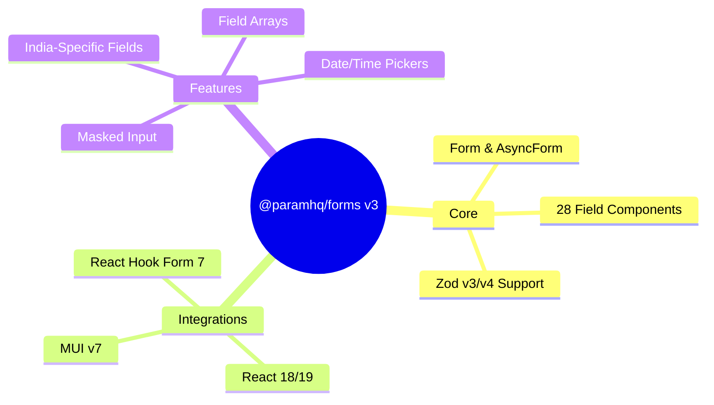
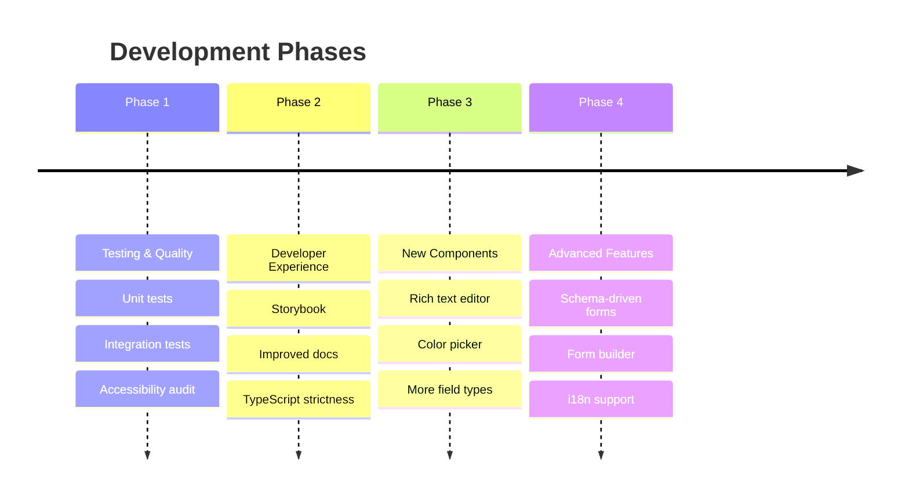
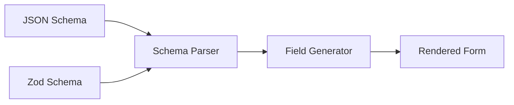

# Project Roadmap

This document outlines the planned development roadmap for @paramhq/forms.

## Current State (v3.0.0)

---

## Roadmap Overview

---

## Phase 1: Testing & Quality

### 1.1 Unit Testing

| Task | Priority | Status |
|------|----------|--------|
| Set up Vitest + React Testing Library | High | Planned |
| Test all field components render correctly | High | Planned |
| Test validation error display | High | Planned |
| Test form submission flow | High | Planned |
| Test India field formatting functions | Medium | Planned |
| Test schema utilities (isSchemaOptional, etc.) | Medium | Planned |

### 1.2 Integration Testing

| Task | Priority | Status |
|------|----------|--------|
| Form + multiple field types integration | High | Planned |
| Async form submission | Medium | Planned |
| Field array CRUD operations | Medium | Planned |
| Date picker with Zod validation | Medium | Planned |

### 1.3 Accessibility Audit

| Task | Priority | Status |
|------|----------|--------|
| ARIA attributes on all components | High | Planned |
| Keyboard navigation testing | High | Planned |
| Screen reader compatibility | High | Planned |
| Color contrast verification | Medium | Planned |
| Focus management in forms | Medium | Planned |

---

## Phase 2: Developer Experience

### 2.1 Storybook Documentation

| Task | Priority | Status |
|------|----------|--------|
| Set up Storybook with MUI theme | High | Planned |
| Stories for all field components | High | Planned |
| Interactive props playground | Medium | Planned |
| Usage examples in stories | Medium | Planned |
| Accessibility addon integration | Medium | Planned |

### 2.2 Documentation Improvements

| Task | Priority | Status |
|------|----------|--------|
| API reference for all components | High | Planned |
| Migration guide from other form libraries | Medium | Planned |
| Video tutorials | Low | Planned |
| More real-world form examples | Medium | Planned |

### 2.3 TypeScript Improvements

| Task | Priority | Status |
|------|----------|--------|
| Remove `any` casts when @hookform/resolvers updates | High | Blocked |
| Stricter generic constraints | Medium | Planned |
| Better type inference for form data | Medium | Planned |
| Export helper types for consumers | Low | Planned |

---

## Phase 3: New Components

### 3.1 High Priority Components

| Component | Description | Status |
|-----------|-------------|--------|
| `RHFRichText` | Rich text editor (Tiptap/Quill) | Planned |
| `RHFColorPicker` | Color selection with presets | Planned |
| `RHFOTP` | One-time password input | Planned |
| `RHFPhoneInput` | International phone with country code | Planned |
| `RHFSignature` | Signature pad capture | Planned |

### 3.2 Medium Priority Components

| Component | Description | Status |
|-----------|-------------|--------|
| `RHFTransferList` | Dual-list selection | Planned |
| `RHFTreeSelect` | Hierarchical selection | Planned |
| `RHFDateRangePicker` | Date range selection | Planned |
| `RHFCreditCard` | Credit card input with validation | Planned |
| `RHFAddressAutocomplete` | Address with Google/Mapbox | Planned |

### 3.3 India-Specific Additions

| Component | Description | Status |
|-----------|-------------|--------|
| `RHFVehicleNumber` | Indian vehicle registration | Planned |
| `RHFUpiId` | UPI ID validation | Planned |
| `RHFEpfoUan` | EPFO UAN number | Planned |
| `RHFDrivingLicense` | DL number format | Planned |
| `RHFVoterId` | Voter ID (EPIC) | Planned |

---

## Phase 4: Advanced Features

### 4.1 Schema-Driven Forms

| Task | Priority | Status |
|------|----------|--------|
| JSON Schema to form renderer | Medium | Planned |
| Zod schema introspection for auto-fields | Medium | Planned |
| Conditional field rendering from schema | Medium | Planned |
| Layout configuration in schema | Low | Planned |

### 4.2 Form Builder

| Task | Priority | Status |
|------|----------|--------|
| Drag-and-drop form builder UI | Low | Planned |
| Export to code/JSON | Low | Planned |
| Preview mode | Low | Planned |
| Save/load form definitions | Low | Planned |

### 4.3 Internationalization (i18n)

| Task | Priority | Status |
|------|----------|--------|
| Default error messages i18n | Medium | Planned |
| RTL layout support | Medium | Planned |
| Locale-aware formatting | Medium | Planned |
| Number/currency localization | Medium | Planned |

### 4.4 Performance Optimizations

| Task | Priority | Status |
|------|----------|--------|
| Bundle size analysis & reduction | Medium | Planned |
| Tree-shaking verification | Medium | Planned |
| Lazy loading for heavy components | Low | Planned |
| Memoization audit | Low | Planned |

---

## Technical Debt

| Item | Description | Priority |
|------|-------------|----------|
| Zod v4 type workaround | Remove `as any` cast when @hookform/resolvers v5+ has proper support | High |
| Date picker types | Improve generic handling for TDate | Medium |
| Schema utilities | Better Zod v4 internal structure handling | Medium |
| Demo app cleanup | Consolidate demo examples | Low |

---

## Version Planning

### v3.1.0 (Next Minor)
- Unit tests for core components
- Accessibility improvements
- Bug fixes

### v3.2.0
- Storybook setup
- RHFOTP component
- RHFColorPicker component

### v4.0.0 (Next Major)
- Remove Zod v3 compatibility layer (if v4 stabilizes)
- Breaking: Require MUI v7+ only
- Schema-driven form rendering
- Full i18n support

---

## Contributing

Areas where contributions are welcome:

1. **Testing** - Help write unit tests for existing components
2. **Accessibility** - Audit and improve ARIA support
3. **Documentation** - Examples and guides
4. **New Components** - Implement planned components
5. **i18n** - Translations for error messages

---

## Dependencies Watch

| Package | Current | Watch For |
|---------|---------|-----------|
| @hookform/resolvers | v5.x | Better Zod v4 type inference |
| @mui/material | v7.x | Breaking changes |
| @mui/x-date-pickers | v7/v8 | API changes |
| zod | v4.x | Stabilization |
| react-hook-form | v7.x | v8 release |
